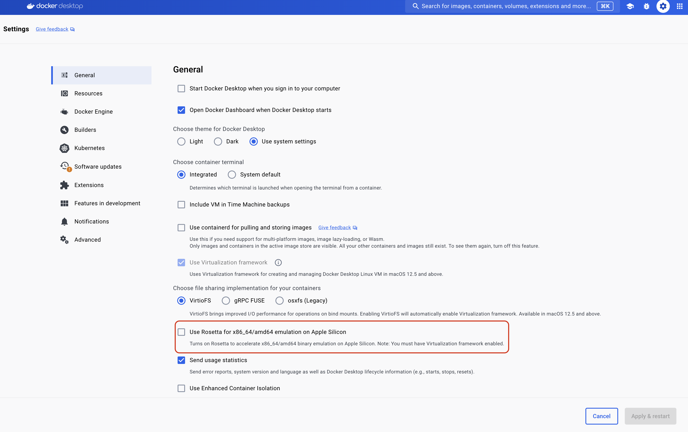

# Testing Inference

You can use the example script [here](../examples/inference/tf_serving_request.py) and the make command `make test-tf-serving` to test the inference of a model served by TensorFlow Serving.

The make command spins up a tensorflow serving Docker container and the script sends a request to the server to get a prediction.

- Depending on your model you will need to edit the inputs to the REST call in the script.
- If you are on an M1/M2 chip then you need to ensure you have turned off `Rosetta` in Docker Desktop settings as seen below:

An E2E example can be run by using the `make test-end-to-end` command, hitting enter where necessary to accept the defaults.

